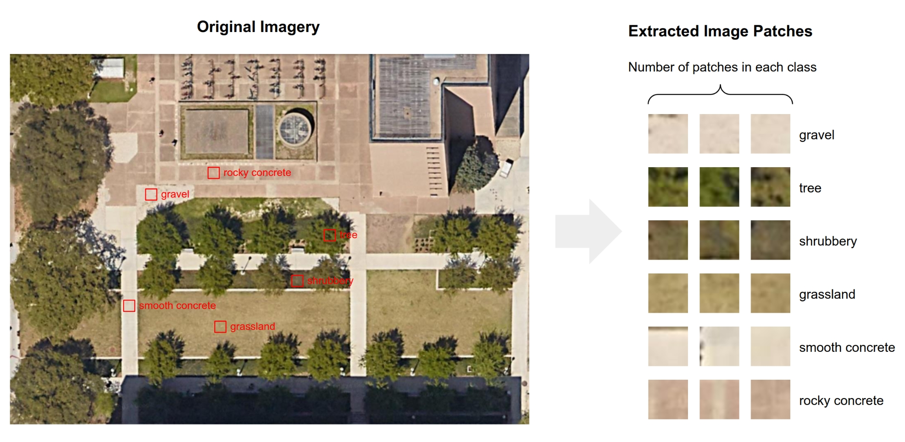

# Image Patch Extractor

## Description
The Image Patch Extractor is a Python script designed for extracting small patches from a larger original image. This tool is particularly useful for researchers looking to construct or augment their own training datasets. By allowing users to manually select specific areas within an image, it provides a customizable approach to dataset creation, especially suited for tasks involving image recognition, classification, and machine learning model training.

Here's an illustration showing the process of extracting patches from an original image:



## Installation

### Prerequisites
- **Python 3.x**: Ensure Python 3 is installed on your system.
- **Required Libraries**: matplotlib, Pillow, NumPy, argparse

### Installing Required Libraries
After installing Python, you can install the required Python libraries using pip. Run the following command in your terminal:

```bash
pip install matplotlib Pillow numpy argparse
```
This command installs matplotlib for image display and interaction, Pillow for image manipulation, numpy for handling arrays, and argparse for parsing command-line arguments.

## Uasage

The script enables the extraction of a specified number of image patches of a defined size from an original image. It allows for manual selection of desired patch locations via mouse clicks on the displayed image.

### Running the Script

To run the Image Patch Extractor, use the following command template in your terminal:

```bash
python3 ImagePatchExtractor.py --image_path "<path_to_image>" --num_patches <number_of_patches> --patch_size <size_of_patches> --output_name "<output_base_name>" --output_dir "<output_directory>"
```

### Command Arguments

    --image_path: Path to the original image from which patches will be extracted.
    --num_patches: Number of patches to extract.
    --patch_size: Size of each square patch in pixels (e.g., 64 for 64x64 pixels).
    --output_name: Base name for the output files. The script appends the patch size and a unique number to each file name.
    --output_dir: Directory where the extracted image patches will be saved.

#### Example Command

```bash
cd /path/to/Image-Patch-Extractor
python3 ImagePatchExtractor.py --image_path "./original_image/Aerial_Imagery.jpg" --num_patches 5 --patch_size 64 --output_name "grassland" --output_dir "./image_patch"
```
**Note**: Ensure that the specified output directory exists before running the script to prevent any issues with saving the patches.
